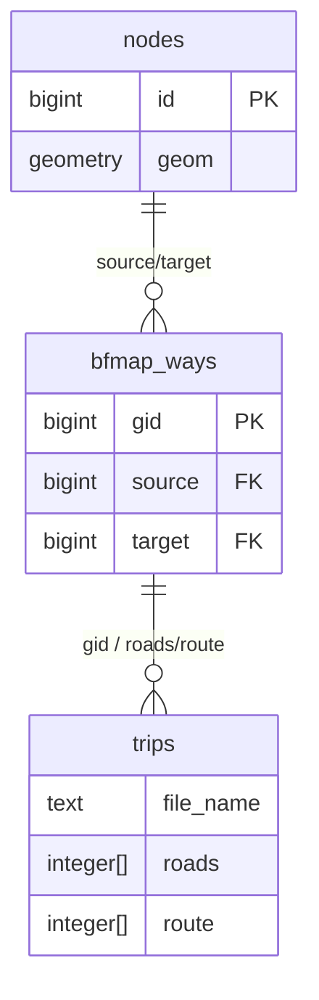

# Data_Middle_platform
## 涉及的所有表及结构
### 1. bfmap_ways — 道路路段表（路网拓扑核心）
| 字段 | 类型 | 说明 |
|------|------|------|
| gid | bigint PK | 全局唯一标识 |
| osm_id | bigint | OSM 原始 ID |
| class_id | integer | 道路分类 ID |
| source | bigint | 起点节点 ID（关联 nodes 表） |
| target | bigint | 终点节点 ID（关联 nodes 表） |
| length | double precision | 路段长度 |
| reverse | double precision | 正反向权重 |
| maxspeed_forward | integer | 正向限速 |
| maxspeed_backward | integer | 反向限速 |
| priority | double precision | 路由优先级 |
| geom | geometry(LineString,4326) | 路段几何线 |

用途：哈尔滨城市路网拓扑数据，描述道路路段及其连接关系，是路径规划和地图匹配的基础路网。
### 2. nodes — 地图节点表
| 字段 | 类型 | 说明 |
|------|------|------|
| id | bigint PK | 节点 ID |
| version | integer | 版本号 |
| user_id | bigint | 用户 ID |
| tstamp | timestamp | 时间戳 |
| changeset_id | bigint | 变更集 ID |
| tags | hstore | 节点标签（键值对） |
| geom | geometry(Point,4326) | 节点经纬度坐标 |

用途：存储路网中的节点（交叉口、转折点等），是 bfmap_ways 的 source/target 关联基础。
### 3. trips — 出租车轨迹表（业务数据核心）
| 字段 | 类型 | 说明 |
|------|------|------|
| file_name | text | 原始 jld 文件名（如 trips_150103.jld2） |
| lon | Real[] | GPS 经度数组（按时间顺序） |
| lat | Real[] | GPS 纬度数组 |
| tms | Real[] | GPS 时间戳数组（Unix 时间） |
| devid | text | 出租车 ID |
| roads | integer[] | 匹配到的道路 ID 数组（bfmap_ways.gid） |
| time | integer[] | 匹配后各道路点的时间戳 |
| frac | Real[] | 在路段上的距离比例 |
| route | integer[] | 完整路径的道路 ID 序列 |
| route_heading | text[] | 行驶方向（forward/backward） |
| route_geom | text[] | 路段几何线字符串 |

用途：出租车 GPS 轨迹数据，已经过**地图匹配（Map Matching）**处理，将原始 GPS 点匹配到路网上。每条记录是一条完整的出租车行程。
### 4. ways — OSM 道路原始表
| 字段 | 类型 | 说明 |
|------|------|------|
| id | bigint PK | 道路 ID |
| version | integer | 版本号 |
| user_id | bigint | 用户 ID |
| tstamp | timestamp | 时间戳 |
| changeset_id | bigint | 变更集 ID |
| tags | hstore | 道路属性标签 |
| nodes | bigint[] | 节点数组 |

用途：OSM 原始道路数据，存储完整的道路几何（由多个节点组成）。
### 5. way_nodes — 道路-节点关联表
| 字段 | 类型 | 说明 |
|------|------|------|
| way_id | bigint | 道路 ID |
| node_id | bigint | 节点 ID |
| sequence_id | integer | 节点在道路中的顺序 |

用途：道路与节点的多对多关系映射。
### 6. 其他辅助表
users — OSM 用户信息  
relations — OSM 关系数据  
relation_members — 关系成员  
schema_info — 数据库版本信息  
temp_ways — 临时道路表  
## 表之间的血缘关系

nodes ←→ bfmap_ways：路段的起点/终点由节点构成
bfmap_ways → trips：轨迹数据通过 roads/route 字段关联到路段
nodes → way_nodes → ways：OSM 原始道路的节点序列
## 数据建模方案（DWD → DWM → DWS）
原始数据已经是宽表形态（trips 表把所有 GPS 点、道路匹配结果都塞在数组里），需要：  
DWD 层：将数组炸开，还原为逐条/逐点的明细事实表  
DWM 层：按天/按车做轻度聚合，保留明细特征  
DWS 层：按维度（车、日、路段、时段）做多维度汇总  
