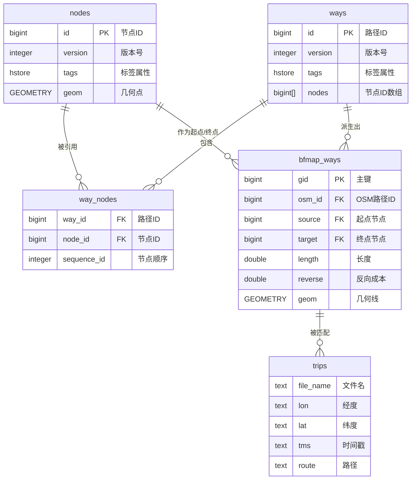
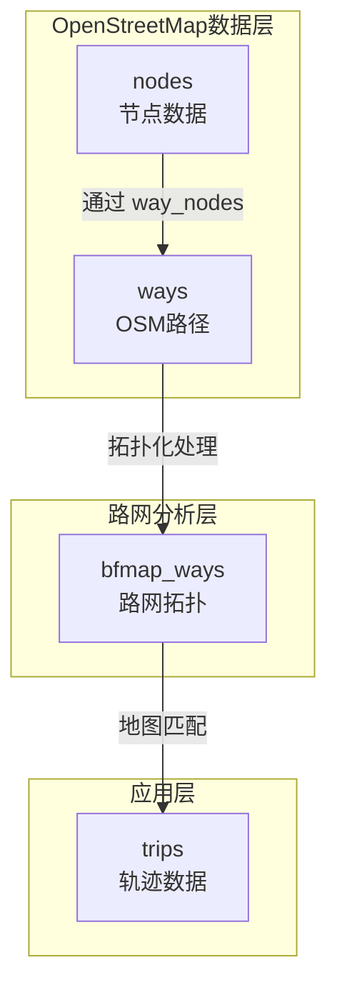
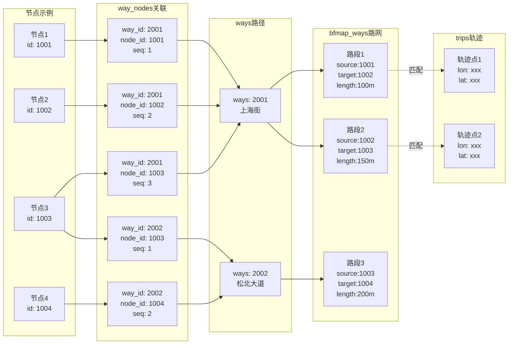

# harbin数据库文档

> 空间地理信息系统数据库 - 包含数据字典与表关系说明

***

## 目录

- [一、数据库概述](#一数据库概述)
- [二、数据字典](#二数据字典)
  - [基础表](#基础表-base-table)
- [三、表关系说明](#三表关系说明)
  - [核心关系链](#核心关系链)
  - [详细关系说明](#详细关系说明)
  - [图形化关系图](#图形化关系图)
- [五、关键索引说明](#五关键索引说明)

***

## 一、数据库概述

这是一个**空间地理信息系统数据库**，主要用于：

- **OpenStreetMap数据存储** - 包含完整的OSM数据结构
- **路网分析** - bfmap\_ways表专为路径规划设计
- **轨迹数据管理** - trips和h5\_trips\_data用于存储移动轨迹
- **空间查询** - 集成PostGIS扩展，支持丰富的空间分析功能

***

## 二、数据字典

### 基础表 (BASE TABLE)

#### 1. bfmap\_ways - 路网拓扑数据

用于路径规划和导航分析的路网拓扑表

| 列名                 | 数据类型             | 可为空 | 默认值  | 说明                 |
| ------------------ | ---------------- | --- | ---- | ------------------ |
| gid                | bigint           | 否   | 自增序列 | 主键，唯一标识            |
| osm\_id            | bigint           | 否   | -    | OpenStreetMap 原始ID |
| class\_id          | integer          | 否   | -    | 道路类别ID             |
| source             | bigint           | 否   | -    | 起点节点ID             |
| target             | bigint           | 否   | -    | 终点节点ID             |
| length             | double precision | 否   | -    | 路段长度               |
| reverse            | double precision | 否   | -    | 反向通行成本             |
| maxspeed\_forward  | integer          | 是   | -    | 正向限速               |
| maxspeed\_backward | integer          | 是   | -    | 反向限速               |
| priority           | double precision | 否   | -    | 优先级                |
| geom               | GEOMETRY         | 是   | -    | 几何形状（LineString）   |

**索引：** idx\_bfmap\_ways\_geom (GiST空间索引)

***

#### 2. nodes - OpenStreetMap 节点

存储地图节点数据（如路口、地标点等）

| 列名            | 数据类型      | 可为空 | 默认值 | 说明          |
| ------------- | --------- | --- | --- | ----------- |
| id            | bigint    | 否   | -   | 主键，节点ID     |
| version       | integer   | 否   | -   | 版本号         |
| user\_id      | integer   | 否   | -   | 编辑者用户ID     |
| tstamp        | timestamp | 否   | -   | 时间戳         |
| changeset\_id | bigint    | 否   | -   | 变更集ID       |
| tags          | hstore    | 是   | -   | 标签属性（键值对）   |
| geom          | GEOMETRY  | 是   | -   | 几何形状（Point） |

**索引：** pk\_nodes (id), idx\_nodes\_geom (GiST空间索引)

***

#### 3. ways - OpenStreetMap 路径

存储地图路径数据（主要是一段道路）

| 列名            | 数据类型      | 可为空 | 默认值 | 说明      |
| ------------- | --------- | --- | --- | ------- |
| id            | bigint    | 否   | -   | 主键，路径ID |
| version       | integer   | 否   | -   | 版本号     |
| user\_id      | integer   | 否   | -   | 编辑者用户ID |
| tstamp        | timestamp | 否   | -   | 时间戳     |
| changeset\_id | bigint    | 否   | -   | 变更集ID   |
| tags          | hstore    | 是   | -   | 标签属性    |
| nodes         | bigint\[] | 是   | -   | 节点ID数组  |

**索引：** pk\_ways (id)

***

#### 4. way\_nodes - 路径节点关联

关联路径与节点，记录节点在路径中的顺序

| 列名           | 数据类型    | 可为空 | 默认值 | 说明   |
| ------------ | ------- | --- | --- | ---- |
| way\_id      | bigint  | 否   | -   | 路径ID |
| node\_id     | bigint  | 否   | -   | 节点ID |
| sequence\_id | integer | 否   | -   | 节点顺序 |

**索引：** pk\_way\_nodes (复合主键), idx\_way\_nodes\_node\_id

***

#### 5. relations - OpenStreetMap 关系

存储复杂地理要素的关系（如多段道路、行政区划等）

| 列名            | 数据类型      | 可为空 | 默认值 | 说明      |
| ------------- | --------- | --- | --- | ------- |
| id            | bigint    | 否   | -   | 主键，关系ID |
| version       | integer   | 否   | -   | 版本号     |
| user\_id      | integer   | 否   | -   | 编辑者用户ID |
| tstamp        | timestamp | 否   | -   | 时间戳     |
| changeset\_id | bigint    | 否   | -   | 变更集ID   |
| tags          | hstore    | 是   | -   | 标签属性    |

**索引：** pk\_relations (主键)

***

#### 6. relation\_members - 关系成员

存储关系的成员信息

| 列名           | 数据类型    | 可为空 | 默认值 | 说明   |
| ------------ | ------- | --- | --- | ---- |
| relation\_id | bigint  | 否   | -   | 关系ID |
| member\_id   | bigint  | 否   | -   | 成员ID |
| member\_type | char    | 否   | -   | 成员类型 |
| member\_role | text    | 否   | -   | 成员角色 |
| sequence\_id | integer | 否   | -   | 成员顺序 |

**索引：** pk\_relation\_members (复合主键), idx\_relation\_members\_member\_id\_and\_type

***

#### 7. users - 用户信息

存储OpenStreetMap编辑用户信息

| 列名   | 数据类型    | 可为空 | 默认值 | 说明      |
| ---- | ------- | --- | --- | ------- |
| id   | integer | 否   | -   | 主键，用户ID |
| name | text    | 否   | -   | 用户名     |

**索引：** pk\_users (主键)

***

#### 8. h5\_trips\_data - H5轨迹数据

存储H5格式的轨迹数据集

| 列名         | 数据类型    | 可为空 | 默认值  | 说明   |
| ---------- | ------- | --- | ---- | ---- |
| id         | integer | 否   | 自增序列 | 主键   |
| file\_name | text    | 否   | -    | 文件名  |
| dataset    | text    | 否   | -    | 数据集名 |
| content    | text    | 否   | -    | 数据内容 |

**索引：** h5\_trips\_data\_pkey (主键)

***

#### 9. trips - 轨迹数据

存储出租车GPS轨迹数据及地图匹配结果

| 列名             | 数据类型 | 可为空 | 默认值 | 说明                                                |
| -------------- | ---- | --- | --- | ------------------------------------------------- |
| file\_name     | text | 是   | -   | 每天的jld文件名，用于标识数据来源                                |
| lon            | text | 是   | -   | 出租车行驶中定时抓取的经度数组，记录GPS轨迹点经度                        |
| lat            | text | 是   | -   | 出租车行驶中定时抓取的纬度数组，记录GPS轨迹点纬度                        |
| tms            | text | 是   | -   | 出租车行驶中定时抓取的时间（毫秒级Unix时间戳数组）                       |
| devid          | text | 是   | -   | 出租车ID，用于标识不同的出租车车辆                                |
| roads          | text | 是   | -   | 地图匹配后每个轨迹点对应的道路ID（bfmap\_ways表中的gid），表示车辆所在道路     |
| time           | text | 是   | -   | 每道路点对应的时间戳数组（秒级Unix时间戳），记录经过各道路的时间                |
| frac           | text | 是   | -   | 行驶过程的距离比例(0-1)，结合bfmap\_ways表中gid的length可计算实际行驶距离 |
| route          | text | 是   | -   | 行驶过程经过的道路ID序列（bfmap\_ways表中的gid），表示完整路径           |
| route\_heading | text | 是   | -   | 行驶过程在道路上的方向（forward正向/backward反向）                 |
| route\_geom    | text | 是   | -   | 行驶轨迹的经纬度几何信息数组，记录匹配后的实际行驶路线                       |

***

#### 10. temp\_ways - 临时路径数据

临时处理的路径数据

| 列名      | 数据类型        | 可为空 | 默认值 | 说明     |
| ------- | ----------- | --- | --- | ------ |
| way\_id | bigint      | 是   | -   | 路径ID   |
| tags    | hstore      | 是   | -   | 标签属性   |
| seq     | integer\[]  | 是   | -   | 序列数组   |
| nodes   | bigint\[]   | 是   | -   | 节点ID数组 |
| counts  | integer\[]  | 是   | -   | 计数数组   |
| geoms   | geometry\[] | 是   | -   | 几何数组   |

***

#### 11. schema\_info - 模式信息

数据库模式版本信息

| 列名      | 数据类型    | 可为空 | 默认值 | 说明     |
| ------- | ------- | --- | --- | ------ |
| version | integer | 否   | -   | 主键，版本号 |

**索引：** pk\_schema\_info (主键)

***

#### 12. spatial\_ref\_sys - 空间参考系统

PostGIS空间参考系统表（系统表）

| 列名         | 数据类型    | 可为空 | 默认值 | 说明      |
| ---------- | ------- | --- | --- | ------- |
| srid       | integer | 否   | -   | 空间参考ID  |
| auth\_name | varchar | 是   | -   | 认证机构名   |
| auth\_srid | integer | 是   | -   | 认证SRID  |
| srtext     | varchar | 是   | -   | WKT格式   |
| proj4text  | varchar | 是   | -   | PROJ4格式 |

**索引：** spatial\_ref\_sys\_pkey (主键)

# 三、表关系说明

### 表关系概述

本数据库主要包含5个核心表，它们共同构成了一个完整的地理信息和轨迹数据系统：

- **nodes** - 基础节点数据（OpenStreetMap）
- **ways** - 路径数据（OpenStreetMap）
- **way\_nodes** - 路径与节点的关联表
- **bfmap\_ways** - 路网拓扑表（用于路径规划）
- **trips** - 轨迹数据表

***

### 核心关系链

```
nodes (节点)
   ↓
way_nodes (关联表)
   ↓
ways (OSM路径)
   ↓
bfmap_ways (路网拓扑)
   ↓
trips (轨迹数据)
```

***

### 详细关系说明

#### 1. nodes ↔ way\_nodes ↔ ways 关系

**关系类型：** 多对多关系（通过 way\_nodes 中间表）

- **nodes 表**：存储所有地图节点（如路口、地标点），主键为 `id`
- **way\_nodes 表**：关联表，通过 `way_id` 关联 ways，通过 `node_id` 关联 nodes
- **ways 表**：存储路径（如道路、河流），主键为 `id`

**关联字段：**

```
nodes.id ←→ way_nodes.node_id
ways.id ←→ way_nodes.way_id
```

**功能：** 一条道路（ways）由多个节点（nodes）组成，way\_nodes 记录节点在道路中的顺序（sequence\_id）。

***

#### 2. ways → bfmap\_ways 关系

**关系类型：** 派生关系

- **ways 表**：原始 OpenStreetMap 路径数据
- **bfmap\_ways 表**：从 ways 派生的路网拓扑表，专门用于路径规划

**关联字段：**

```
ways.id ←→ bfmap_ways.osm_id
```

**功能：** bfmap\_ways 基于 ways 数据构建，增加了路网拓扑信息（source、target 节点，length、reverse 成本等），支持 Dijkstra、A\* 等路径规划算法。

**bfmap\_ways 的拓扑结构：**

- `source` - 路段起点节点ID
- `target` - 路段终点节点ID
- `length` - 路段长度（通行成本）
- `reverse` - 反向通行成本
- `maxspeed_forward/backward` - 限速信息

***

#### 3. bfmap\_ways ↔ trips 关系

**关系类型：** 参考关系

- **bfmap\_ways 表**：提供路网参考
- **trips 表**：存储实际轨迹数据

**功能：** trips 表中的轨迹数据可以匹配到 bfmap\_ways 的路网上，实现地图匹配（Map Matching）功能。

**trips 表相关字段：**

- `lon` / `lat` - 经纬度坐标
- `route` / `route_geom` - 路径信息
- `roads` - 匹配到的道路信息

***

### 图形化关系图

#### ER图（实体关系图）



***

#### 数据流向图



***

#### 具体示例图



## 

## 四、关键索引说明

为了优化关系查询性能，以下索引非常重要：

| 表名          | 索引名                       | 用途         |
| ----------- | ------------------------- | ---------- |
| nodes       | pk\_nodes                 | 节点主键查询     |
| nodes       | idx\_nodes\_geom          | 空间查询（附近节点） |
| ways        | pk\_ways                  | 路径主键查询     |
| way\_nodes  | pk\_way\_nodes            | 复合主键查询     |
| way\_nodes  | idx\_way\_nodes\_node\_id | 按节点查询所属路径  |
| bfmap\_ways | idx\_bfmap\_ways\_geom    | 空间查询（附近路段） |

***

